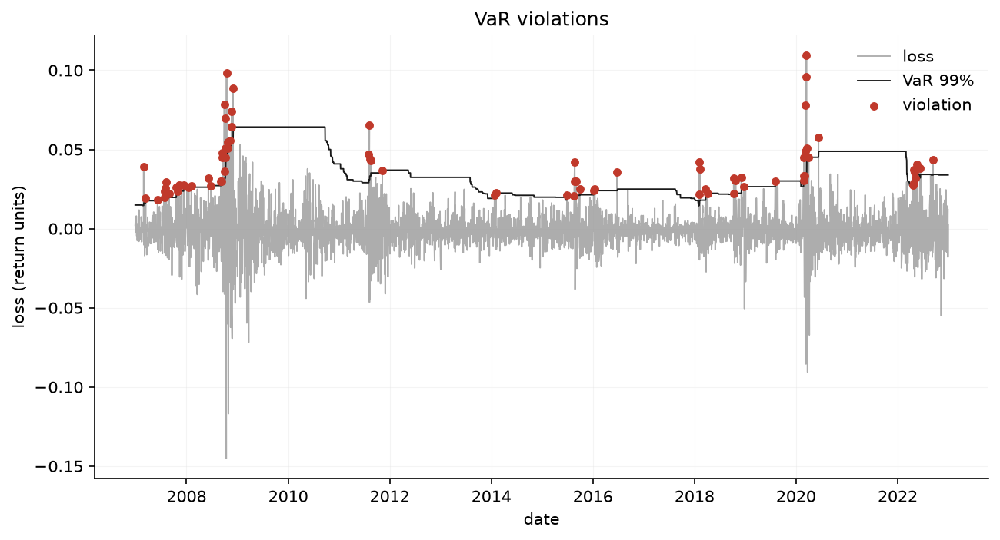
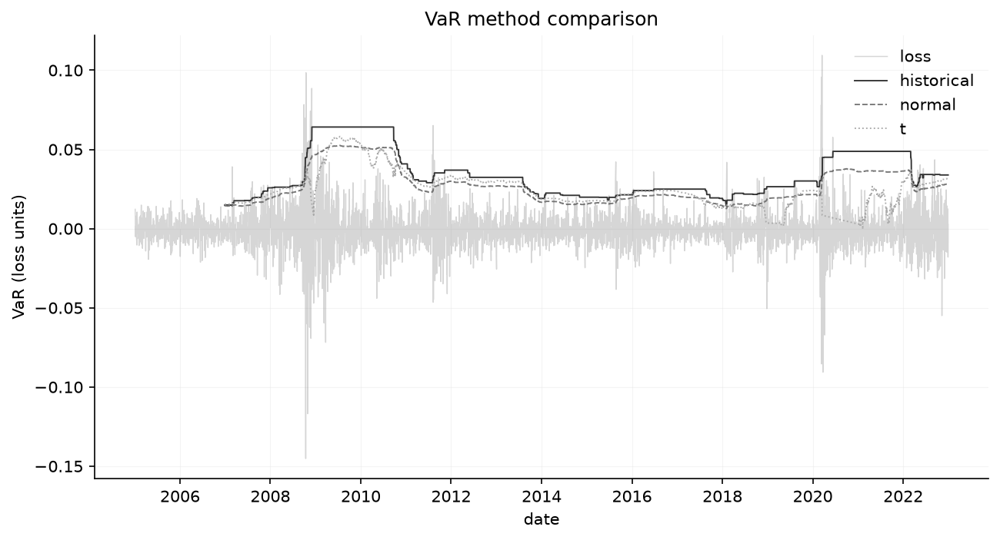
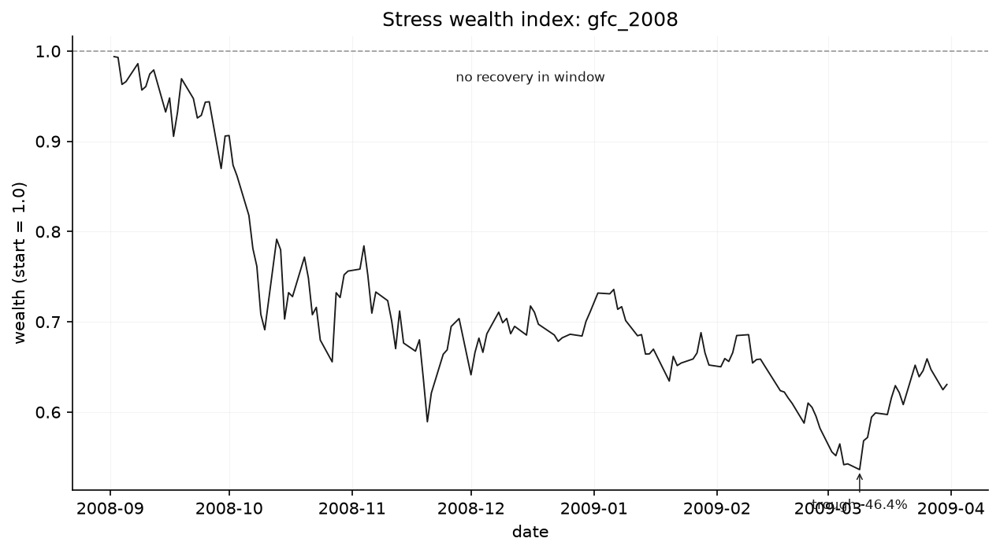
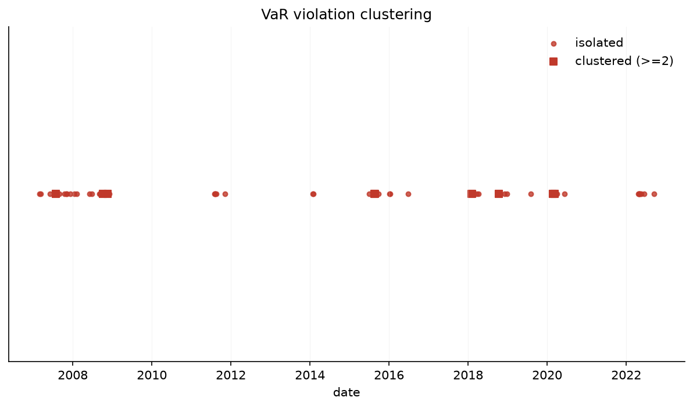

# リスクエンジン

     
<!-- coverage badge: replace with codecov dynamic badge after first CI run -->

ヒストリカル・シミュレーション、パラメトリック（正規 / スチューデント $t$）クローズドフォーム、
そしてヒストリカルなストレス再現によって、バリュー・アット・リスク（VaR）と期待ショートフォール
（ES）を計算するポートフォリオ・リスクエンジンです。統計的バックテストとモノクロのレポート層を
備えています。設計思想は、**見栄えより検証可能性**（すべての数値は生データから再現可能）、
**限界に対して誠実**（前提と破綻条件を隠さず明示する）、**アウト・オブ・サンプルの規律**
（時点 $t$ の推定値は $t$ より厳密に前のデータのみから計算でき、後のデータは決して使わない）、
そして **数値を盛らない**（経験的な結果をそのまま報告する。保守的なごまかし・クリッピング・
水増しは行わない。良すぎる数値はバグが証明されるまでバグとみなす）です。

*English: [README.md](README.md)*

---

## モジュール構成

- **`src/data/loader.py`** — 純粋なデータ層。`fetch_prices` は yfinance 経由で日次調整後終値を
  ダウンロードし（単一・複数ティッカーの形状を正規化し、空データで例外を送出、欠損 5% 超で警告）、
  `prices_to_returns` は単純収益率または対数収益率を計算します。リスクのロジックはここには置きません。
- **`src/var/historical.py`** — ヒストリカル・シミュレーションによる VaR + ES、厳密なノールック
  アヘッド保証付きのローリング推定、および日次リバランスのポートフォリオ集約。
- **`src/var/parametric.py`** — 正規分布およびスチューデント $t$ 分布によるパラメトリック VaR + ES。
  ES はクローズドフォームで、$t$ の自由度はスケール自由の最尤推定で求めます。
- **`src/backtest/var_backtest.py`** — VaR バックテスト：Kupiec の比率検定（POF）、Christoffersen の
  独立性検定、両者を組み合わせた条件付きカバレッジ、および Basel の信号機ゾーン分類。
- **`src/stress/scenarios.py`** — ヒストリカルなストレス再現（2008 年 GFC、2020 年 COVID のプリセット）。
  各期間について累積収益率、最大ドローダウン、回復期間、VaR 違反率を報告します。
- **`src/report/plots.py`** — モノクロで機関投資家的なレポート層。グレースケールのパレットと、
  違反マーカー専用のただ一つのアクセント色を用いた、4 つの作図関数と 1 つの保存ヘルパー。

唯一の違反定義（`-return > VaR`、厳密な不等号）は `src/var/_utils.py` に置かれ、バックテスト層・
ストレス層・レポート層から再利用されます。単一の真実の源（single source of truth）であり、統計と
可視化が食い違うことは決して起こりません。

---

## アーキテクチャ

### モジュールマップ

```
src/
├── data/loader.py           fetch_prices / prices_to_returns
├── var/
│   ├── _utils.py            _clean / _min_obs / violations (shared, scipy-free)
│   ├── historical.py        historical-simulation VaR/ES
│   └── parametric.py        normal + Student-t VaR/ES (closed form)
├── backtest/var_backtest.py Kupiec POF / Christoffersen / Basel traffic-light
├── stress/scenarios.py      GFC 2008 / COVID 2020 stress scenarios
└── report/plots.py          monochrome visualization (scipy-free)
```

### 依存構造

```
var._utils          (scipy-free leaf: _clean, _min_obs, violations)
    ↑                   ↑               ↑
var.historical   var.parametric    stress.scenarios    report.plots
                  (scipy)
                      ↑
               var_backtest  (scipy)
```

`report.plots` は意図的に scipy 非依存です。インポートしても scipy を引き込まず、
可視化層を軽量に保ちます。scipy をインポートするのは `var.parametric`
（クローズドフォームの `norm` / スチューデント `t`）と `var_backtest`
（カイ二乗 p 値）の 2 つだけで、その他のモジュールはすべて scipy 非依存です。
`var._utils` はモジュール間で共有されるロジックの単一の真実の源
（single source of truth）です。

すべての非自明な設計判断の根拠については、[DESIGN.md](docs/DESIGN.md) を参照してください。

---

## 数学的定義

### 符号の規約

日次収益率は算術（単純）です。損失は収益率の符号反転として定義します：

$$L_t = -r_t$$

VaR と ES は **正の損失量** として報告します。$-5\%$ の収益率は $+0.05$ の損失になります。

### バリュー・アット・リスクと期待ショートフォール

$$\text{VaR}_c = Q_c(L), \qquad \text{ES}_c = \mathbb{E}[L \mid L \geq \text{VaR}_c]$$

$Q_c$ は損失分布の $c$ 分位点です。すなわち $\text{VaR}_c$ は収益率の $(1-c)$ 下側分位点を符号反転した
ものです。ES の境界は $>$ ではなく $\geq$ なので、VaR の観測値自身が裾に含まれます。裾が退化している
（空の）場合、ES は VaR にフォールバックします。不変条件 $\text{ES}_c \geq \text{VaR}_c$ は常に成り立ち
ます。標本に損失が一つもない場合、$\text{VaR}_c \leq 0$ をそのまま報告し、ゼロにクリップしません。

### ヒストリカル vs. パラメトリック — トレードオフ

ヒストリカル・シミュレーションは実現損失の **経験分位点** を用い、分布の仮定を一切置きません。標本中の
最悪損失を超えて外挿することはできませんが、何も捏造もしません。パラメトリック VaR は分布をフィット
して **クローズドフォーム** から分位点を読み取ります。滑らかで最悪のヒストリカル損失を超えて外挿でき
ますが、仮定した分布の良し悪しがそのまま精度になります。**正規** モデルはファットテールを系統的に過小
評価します。**スチューデント $t$** モデルはそれを捉えますが、自由度 $\nu$ の安定した推定に依存し、短い
窓ではノイズが大きくなります。ファットテールのデータで正規 ES がヒストリカル ES を下回るのは、誤った
仕様のモデルの *正しい* 出力であって、バグではありません。

スチューデント $t$ では $\sigma$ は **実際のボラティリティ**（標本標準偏差）であり、分布はスケール
$= \sigma\sqrt{(\nu-2)/\nu}$ によってそれに標準化されます。これにより $t$ と正規は分散を共有し、裾の
形状だけが異なります。$\nu$ はスケール自由の MLE で推定します。複数日ホライズンでは
$\mu \to \mu h$、$\sigma \to \sigma\sqrt{h}$（i.i.d. のクローズドフォーム・スケーリング）と縮尺します。
これは非重複の $h$ 日ブロックを複利合成するヒストリカルモジュールとは対照的です。

### バックテスト

$T$ 観測中に $x$ 件の違反があり、帰無率を $p = 1-c$ とすると、Kupiec の比率検定統計量は

$$\text{LR}_{\text{POF}} = -2\ln\frac{(1-p)^{T-x}\,p^{x}}{(1-\hat\pi)^{T-x}\,\hat\pi^{x}}, \qquad \hat\pi = \tfrac{x}{T},$$

で、$\chi^2_1$ に従います。$x=0$ のときこれは $-2T\ln(1-p) > 0$ になります（ゼロではありません。違反が
期待されるのに一件も起きないこと自体が情報を持ちます）。Christoffersen の独立性統計量
$\text{LR}_{\text{ind}}$（$\chi^2_1$）は違反系列の一次マルコフモデルと i.i.d. モデルを比較し、
クラスタリングを検出します。条件付きカバレッジは両者を結合します：

$$\text{LR}_{\text{cc}} = \text{LR}_{\text{POF}} + \text{LR}_{\text{ind}} \sim \chi^2_2.$$

$p$ 値は $\chi^2$ の生存関数を用います。

### ドローダウンと回復

事前資本 $1.0$ で下限を取ったランニングピークを持つ富インデックス
$W_t = \prod_{i \le t}(1+r_i)$ 上で、

$$\text{MDD} = \max_t \frac{\text{peak}_t - W_t}{\text{peak}_t},$$

これは正の量です。回復とは、谷の後で初めて $W_t \geq 1.0$ となる日付であり、**事前水準** への復帰を意味し、
窓内の高値への復帰ではありません。カレンダー日数で測り、窓内で回復しない場合は `None` です。

---

## ノールックアヘッド保証

これが信頼性の核心です。日付 $t$ に割り当てられるローリング推定値は `returns.iloc[i-window:i]` から
計算されます。すなわち位置 $i{-}\text{window}, \ldots, i{-}1$ の `window` 個の観測です。上限は **排他的**
で、位置 $i$（$t$ 自身）は決して読まれません。最初の行は `index[window]` に置かれ、結果の長さは
`n_obs - window` になります。

これを 2 つの相補的なガードがテストスイートで強制します：

**変異テスト** — ローリング結果を計算した後、$t$ *自身を含む* $\geq t$ のすべての日付の収益率を大きな
定数でショックします。$t$ の行は前後で不変でなければなりません。$t$ より厳密に *後* の日付だけを変異
させても不十分です。素朴な `.rolling(window)` 集約（よくある誤り）は現在行を読むため、この弱い検査は
通過しますが、こちらは失敗します。

**等価テスト** — $t$ のローリング行は、ちょうど `returns.iloc[i-window:i]` 上で実行した時点推定器と数値的に
同一であることが、複数の日付と信頼水準にわたって表明されます。両者が同じ数値コアを通るためです。

解決不能な裾の下限（コードでは `MIN_OBS`）は至る所で強制されます：

$$n_{\min}(c) = \left\lceil \frac{1}{1-c} \right\rceil$$

$c = 0.99$ ではこれは 100 です。これを下回ると $(1-c)$ 分位点は経験推定を装った純粋な外挿になり、`ValueError` が送出されます。

---

## 実証結果（SPY、2005–2022）

`python scripts/generate_readme_figures.py` で再生成できます。以下の図と数値はその実行（ローリング窓 500、
$c = 0.99$）によるものです。

### VaR 違反



ローリング 99% ヒストリカル VaR に対する日次損失。違反（損失 > VaR）はアクセント色でマークされています。
2008 年と 2020 年に鋭くクラスター化しており、まさに i.i.d. モデルが起きないと仮定する場所で起きています。

### VaR 手法の比較



ヒストリカル、パラメトリック正規、パラメトリック $t$ のローリング VaR を重ね描き（色は違反専用のため、
グレースケールの濃淡と線種で区別）。ヒストリカル VaR は経験的な裾に応じて階段状に動き、パラメトリックの
線はより滑らかですが平穏期には低く位置します。これがまさに過剰違反の理由です。

### ストレス：2008 年 GFC の富インデックス



GFC 期間（2008-09-01 〜 2009-03-31）の富インデックスに谷を注記したもの。ドローダウンは **46.4%** に達し、
**窓内では回復しません**。市場は 2009 年 3 月に底を打ち、回復はその後でした。

### 違反のクラスタリング



違反日付のラグプロット。孤立した違反と連続日のラン（長さ $\geq 2$）を区別しています。このクラスターこそ
Christoffersen の独立性検定が検出するものであり、条件付きカバレッジが決定的に棄却する理由です。

### 数値を、誠実に

| 手法 | 観測数 | 違反率（期待値 1.00%） | POF $p$ | 独立性 $p$ | 条件付きカバレッジ $p$ |
|---|---|---|---|---|---|
| ヒストリカル | 4030 | **1.94%** | $1.2\times10^{-7}$ | $1.5\times10^{-5}$ | $7.4\times10^{-11}$ |
| パラメトリック正規 | 4030 | **3.23%** | $1.7\times10^{-29}$ | $3.4\times10^{-6}$ | $5.1\times10^{-33}$ |
| パラメトリック $t$ | 3700 | **3.59%** | $1.1\times10^{-34}$ | $8.5\times10^{-10}$ | $1.2\times10^{-41}$ |

ストレス期間（ヒストリカル・ローリング VaR に対する VaR 違反率）：

| シナリオ | 累積収益率 | 最大ドローダウン | 回復 | VaR 違反率 |
|---|---|---|---|---|
| GFC 2008 | $-36.95\%$ | $46.38\%$ | 窓内で回復なし | $10.96\%$ |
| COVID 2020 | $-3.17\%$ | $33.72\%$ | 77 カレンダー日 | $10.58\%$ |

**すべてのモデルがバックテストで棄却されます**（POF・独立性・条件付きカバレッジで $p \approx 0$）。
GFC と COVID の期間では VaR 違反が名目率のおよそ 10 倍に達します。これは失敗ではなく発見です。エンジンは、
単純な 99% VaR モデル（ヒストリカルもパラメトリックも）がリスクを過小評価し、危機時のクラスタリングの下で
破綻することを正しく示しています。COVID の累積収益率が小さい（$-3.2\%$）のは、窓が回復を含むからこそであり、
**ドローダウン**（$33.7\%$）が危機のシグナルです。両者を混同するのは、この層が避けるために作られた典型的な誤りです。

---

## 限界

- **経験的 VaR は最悪のヒストリカル損失を超えて外挿できません。** $n$ 観測の $(1-c)$ 分位点は最小実現損失で
  抑えられます。高い $c$・短い窓では期待される裾の観測が 1 件未満となり、不安定です。
- **裾の推定はサンプリング誤差が大きいです。** 遠い裾の分位点は収束が遅く、$c=0.99$・数百観測では標準誤差が
  推定値と同程度です。パラメトリック手法はこのサンプリング誤差を分布仮定の誤差と引き換えにします。
- **データの注意点（yfinance）。** 生存者バイアス補正なし。配当・分割調整はプロバイダ依存。休日・取引ギャップの
  扱いが収益率の連続性に影響します。すべての下流推定はこれらの限界を引き継ぎます。
- **スケール自由の $t$ MLE は、短いまたは外れ値が支配的な窓で $\nu \leq 2$（無限分散）を返すことがあります。**
  時点推定の `parametric_t_var` は例外を送出し、ローリングは系列を中断する代わりにその行を `NaN` に劣化させます。
  安定した $t$ ローリング推定には窓 $\geq 250$ を使ってください（ファットテールでも経験的に失敗率 $\sim 0\%$）。

---

## 使い方

```python
import numpy as np
import pandas as pd

from src.data.loader import fetch_prices, prices_to_returns
from src.var.historical import rolling_historical_var
from src.var.parametric import rolling_parametric_var
from src.backtest.var_backtest import backtest_var
from src.stress.scenarios import run_preset_scenarios

# 実データ
prices = fetch_prices(["SPY"], "2005-01-01", "2022-12-31")
returns = prices_to_returns(prices, method="simple")["SPY"]

# ローリング 99% VaR + ES、ノールックアヘッド
roll = rolling_historical_var(returns, window=500, confidence=0.99)  # 列 ['var','es']

# 実現収益率に対してローリング VaR をバックテスト
aligned = returns.loc[roll.index]
result = backtest_var(aligned, roll["var"], confidence=0.99, method="historical")
print(result.violation_rate, result.pvalue_cc, result.basel_zone)

# パラメトリック比較 + ヒストリカル・ストレス再現
rt = rolling_parametric_var(returns, method="t", window=500, confidence=0.99)
scenarios = run_preset_scenarios(returns, var_series=roll["var"], var_method="historical")
print(scenarios["gfc_2008"].max_drawdown, scenarios["covid_2020"].recovery_days)
```

VaR と ES は収益率単位の **正の損失量** です。`var` が `0.0231` なら、標本中の最大 1% の日で 2.31% の損失が
超過されることを意味します。

---

## テスト

エンジンはテストファースト（TDD）で、ECC の「計画 → テスト → 実装 → レビュー → ゲート付きコミット」
ワークフローの下で構築されています。**144 のユニットテスト** に加えて **4 つの統合テスト**（実市場データ、
`pytest -m integration` の背後にあり既定ではスキップ）が全モジュールを網羅し、エンジンモジュールで
**行カバレッジ 100%**、`ruff` / `black` はクリーンです。

```bash
pip install -r requirements.txt           # ランタイム依存
pip install -r requirements-dev.txt       # pytest, pytest-cov, ruff, black

pytest tests/                             # 全スイート（統合テストは自動スキップ）
pytest -m integration tests/             # ネットワーク統合テスト、明示的に
pytest tests/ --cov=src --cov-report=term-missing
ruff check src/ tests/ && black --check src/ tests/
```

ノールックアヘッドの二重ガード（$t$ 以降の変異、事前窓との等価性）はすべてのローリング推定器で実行されます。
統計的主張は手計算のフィクスチャ（Kupiec/Christoffersen の LR 統計量、正規 / $t$ のクローズドフォーム）で
$10^{-10}$ まで固定されています。

---

## 技術スタック

Python（NumPy、pandas、SciPy、Matplotlib、yfinance）。開発ツール：pytest、pytest-cov、ruff、black。
ランタイム依存は `requirements.txt`、開発・テストツールは別の `requirements-dev.txt` に分けています。
